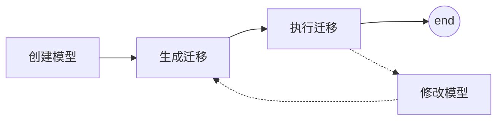

# 2 模型 & admin管理后台

>  概要：
>
>  + 讲述 Model 模型部分。怎么通过定义 python 类——而非 SQL 语句——实现和数据库交互。
>  + 并调用 shell 、后台页面 /admin.html 完成数据的 CRUD。


---



## 配置 settings.py

### 数据库

（略）教程直接用 sqlite，无需改配置。

```python
DATABASES = {
    'default': {
        'ENGINE': 'django.db.backends.sqlite3',
        'NAME': os.path.join(BASE_DIR, 'db.sqlite3'),
    }
}
```

可改 MySQL, SQLAlchemy 等等……

### 应用

```python
INSTALLED_APPS = [
    'django.contrib.admin',			# 管理员站点
    'django.contrib.auth',			# 认证授权系统
    'django.contrib.contenttypes',	# 内容类型框架
    'django.contrib.sessions',		# 会话框架
    'django.contrib.messages',		# 消息框架
    'django.contrib.staticfiles',	# 管理静态文件的框架
]
```

## 创建模型

Django 通过继承 django.db.models.Model 类的子类，操作数据库。属性对应字段，是 Field 类的实例。

| Django             | 数据库                     |
| ------------------ | -------------------------- |
| 类 class：Question | 表格 TABLE：polls_question |
| 属性               | 字段                       |

```python
# polls/models.py
from django.db import models


class Question(models.Model):
    question_text = models.CharField(max_length=200)
    pub_date = models.DateTimeField('date published')
    
    
class Choice(models.Model):
    question = models.ForeignKey(Question, on_delete=models.CASCADE)
    choice_text = models.CharField(max_length=200)
    votes = models.IntegerField(default = 0)
```

关键是搞懂数据表对应关系，一对多 这些怎么弄？注意 11 行，外键的写法。

models.XXXField:

+ IntegerField
+ CharField
+ TextField
+ DateTimeField

## 激活模型

```python
INSTALLED_APPS = [
    'polls.apps.PollsConfig',  # 不像其它视频教程直接写 app 名，而是把app下apps.py的类放进来！
    ...
]
```

## 连接数据库

应用修改后&使用前 都必须 迁移 `python manage.py makemigrations` 和执行迁移 `python manage.py migrate`。

1. 生成迁移 `python manage.py makemigrations` 
2. 执行迁移 `python manage.py migrate`


执行前查看迁移命令的方法：

1. 看`app文件夹/migrations/0001_initial.py`
2. Terminal 中输入 `python manage.py sqlmigrate polls 0001`

---

## Shell

适合调试。但数据库操作更适合利用 admin 提供的后台页面完成，或者数据库软件完成。

进入shell：`python manage.py shell` 

+ 类.objects
    + .all()
    + .get(id=1)
    + .get(pk=1)
    + .get(pub_date_year=current_year)
    + .filter(id=1)
    + .filter(question_text__startswith='What')
    + q = Question.objects.get(pk=1)

注意1对多关系（Question 对 Choice)：多的一方引用回去仅需 .question, 而反之则需要 .choice==_set== 操作。

+ c = q.choice==_set.create==(choice_text='The sky', votes=0)
+ c.question
+ q.choice_set.all()
+ q.choice_set.count()

## 管理后台

```shell
...\> py manage.py createsuperuser
```

+ 账号：doraamd
+ 邮箱：XXXXXXXXXX@qq.com
+ 密码：zheshimima

`py manage.py runserver` 然后打开 http://127.0.0.1:8000/admin/ 进入管理后台。

向 admin 添加模型类。

```python
# polls/admin.py
from django.contrib import admin
from .models import Question

admin.site.register(Question)
```

