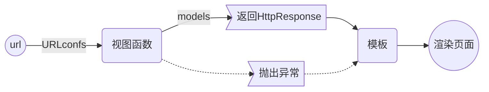

# 3 视图 & 模板


---

MTV 的逻辑流程：



本章涉及的文件：

| url                                      | 视图                                       | 模板                                                         |
| ---------------------------------------- | ------------------------------------------ | ------------------------------------------------------------ |
| polls/<a href='#urls'><u>urls</u></a>.py | polls/<a href='#views'><u>views</u></a>.py | polls/templates/polls/<a href='#index'><u>index</u></a>.html<br />polls/templates/polls/<a href='#detail'><u>detail</u></a>.html |


## 视图

<span name='views' id='views'>polls/<u>views</u>.py</span>

```python
import ...


def index(request):
    """只显示最新发布的5条问题"""
    latest_question_list = Question.objects.order_by('-pub_date')[:5]
    context = {'latest_question_list': latest_question_list}
    return render(request, 'polls/index.html', context)


def detail(request, question_id):
    question = get_object_or_404(Question, pk=question_id)
    return render(request, 'polls/detail.html', {'question': question})


def results(request, question_id):
    response = "You're looking at result of question %s."
    return HttpResponse(response % question_id)


def vote(request, question_id):
    return HttpResponse(f"You're voting on question {question_id}.")

```

### 函数

==**render**==(request, 模板, 上下文) 函数：载入模板，填充上下文，返回生成的 HttpResponse 对象。

==**get_object_or_404**==(模型类, 任意数量的关键字参数) 函数。

### 疑问

✔为什么第18行 的参数里有个 %  ？

> 看 17 行，格式化字符串。相当于 拼接了 "... %s" 和  %...

❓ 第6行 order_by() 参数里 ==-==pub_date 前面为什么加了 \- ?  倒序？shell 测试加和不加一样。[^order_by]

## 路由

添加 URL patterns 至 <span name='urls' id='urls'>polls/<u>urls</u>.py</span>：

```python
# polls/urls.py
from django.urls import path
from . import views

app_name = 'polls'	# 命名空间
urlpatterns = [
    path('', views.index, name='index'),
    path('<int:question_id>/', views.detail, name='detail'),
    # path('specifics/<int:question_id>/', views.detail, name='detail'), 测试失败！
    path('<int:question_id>/results/', views.results, name='results'),
    path('<int:question_id>/vote/', views.vote, name='vote'),
]

```

第5行 app_name 指定命名空间，避免多个 app 之间有重名的模板冲突。

path() 函数 的第一个参数 route 讲解：

- 可以用正则表达式
- 尖括号 \<> 是类型转换器： \<int:question_id> 把捕获内容转换成 int 类型后，传给视图函数对应的参数 question_id。
- 不要加不必要的东西，比如 .html

## 模板

创建 Templates 模板：**<u>poll</u>s/templates/<u>polls</u>/**index.html。

第二个polls 是利用命名空间避免与其它app的模板文件重名。


本例模板如下：

1. 投票索引页：polls/templates/<u><span name='index' id='index'>polls/index</span></u>.html

    ```html
    
        <ul>
        
            <li><a href="">{{ question.question_text }}</a></li>
        
        </ul>
    
        <p>No polls are available.</p>
    
    ```
    
    第6行 href 后的变量采用  软编码方式：

    + 所有url变更都在 polls/urls.py 中完成。
+ 用 polls: 限定 detail 避免重名。


2. 投票详情页：polls/templates/<u><span name='detail' id='detail'>polls/detail</span></u>.html

    ```html
    // polls/templates/polls/detail.html
    
    <h1>{{ question.question_text }}</h1>
    <ul>
    
        <li>{{ choice.choice_text }}</li>
    
    ```

Django 采用了和 Flask 很类似的语言 {{变量}}  

## 疑问汇总

[^order_by]: 第6行 order_by() 参数里 ==-==pub_date 前面为什么加了 \- ?  倒序？shell 测试加和不加一样。